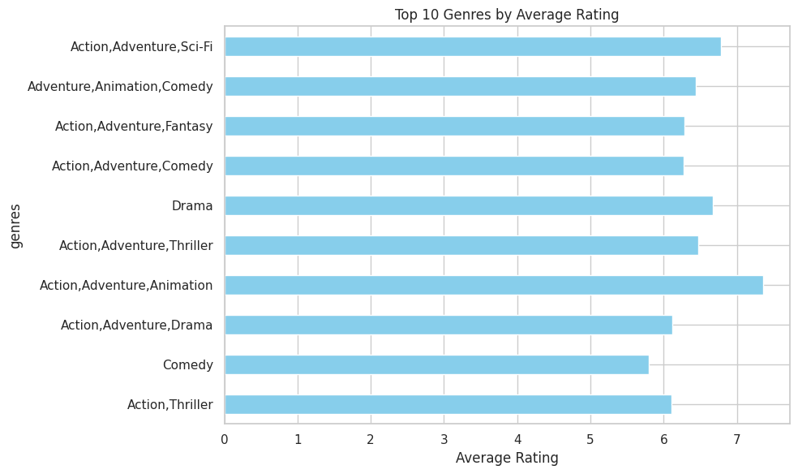
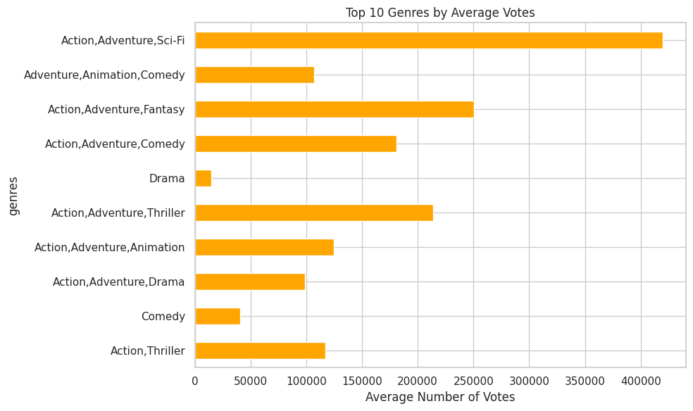
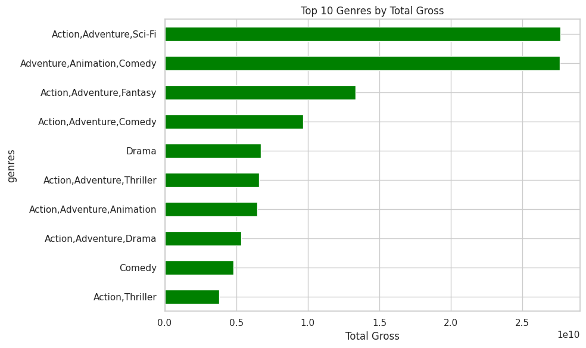
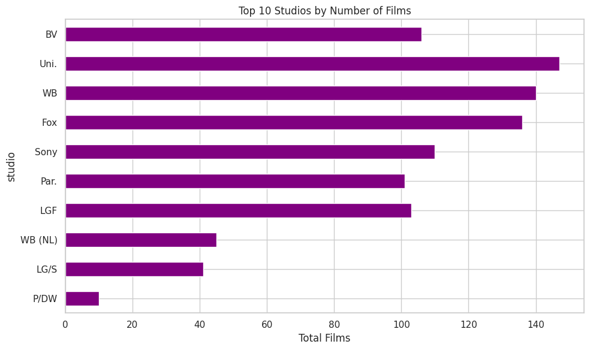
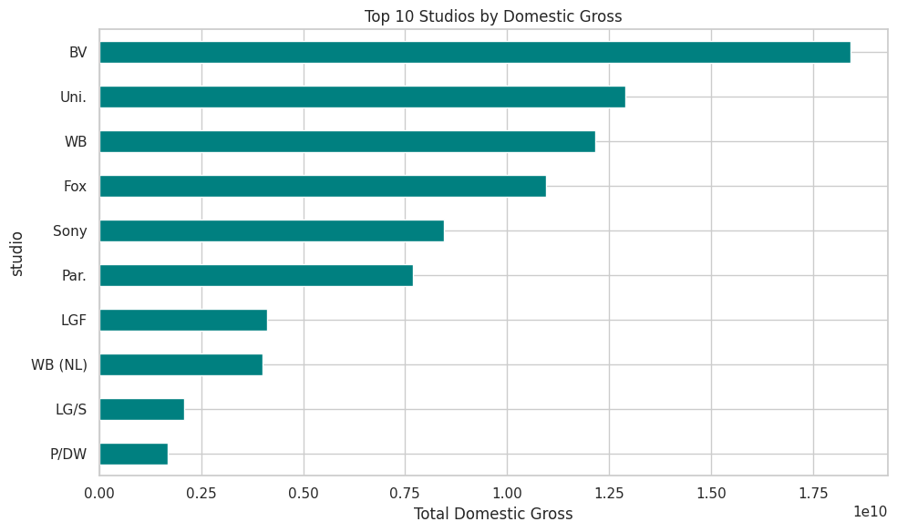
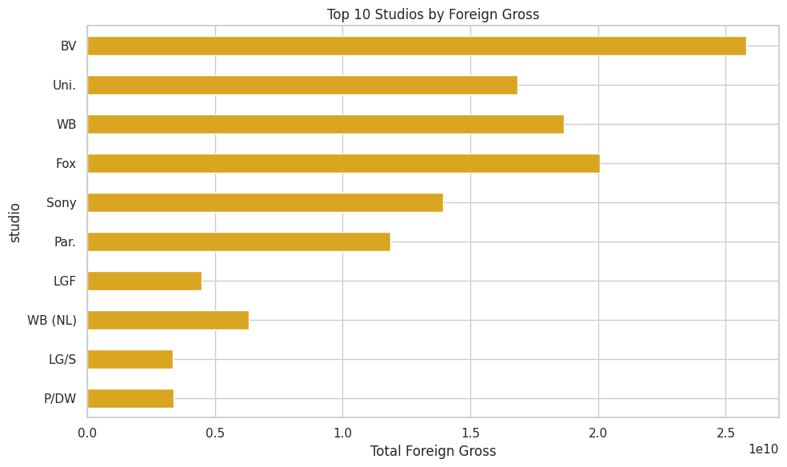

# Microsoft Film Analysis

## Project Overview
Microsoft is exploring the possibility of entering the film industry by launching a new movie studio. This project uses data visualization to analyze existing trends in the film market—such as genre performance, budget ranges, and revenue patterns—to uncover what makes a movie successful at the box office.
## Business Problem
As a new player in the film industry, Microsoft lacks insight into what types of films perform well commercially. To make data-driven production decisions, the company needs an analysis of past box office trends to identify high-potential film genres, optimal budget ranges, and release strategies.
## Data
In this analysis we will use data from IMDB and Box office Mojo:
* imdb.title.basics
* imdb.title.ratings
* bom.movie_gross
## Methods
To avoid making this one too long, the datasets were cleaned and analyzed in a different notebook called moviesanalysis.ipynb for a more thorough examination.

I looked for questions that spoke to the business challenge in order to examine the data, and these were:
1. Most successful genres
2. Most successful studios
3. Runtime of a successful film
## Results
The results are based on the three questions above
1. Most successful genres

2. Most succesful studios

3. Runtime of a successful studio

## Conclusions
Based on the results above I can confidently reccomend Microsoft to try a combination of the following genres:
1. Action
2. Adventure
3. Sci-fi
4. Comedy
5. Thriller
6. Drama
7. Animation

